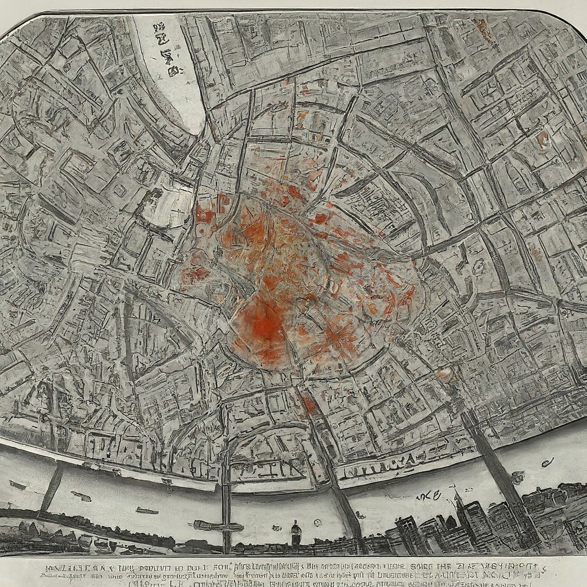

# The Ghost Map Project

## Overview
Welcome to the Ghost Map Project, inspired by the pioneering work of Dr. John Snow in epidemiology. This project aims to showcase Snow's revolutionary investigation into the 1854 cholera outbreak in London and his creation of the famous "Ghost Map."

## Key Features
- **Data Exploration**: Utilize Python and Jupyter to analyze datasets related to the 1854 cholera outbreak.
- **Data Analysis**: Dive into the data behind the cholera outbreak and understand Snow's methodology.
- **Interactive Map**: Explore a digital recreation of John Snow's original cholera map. 
- **Historical Context**: Learn about the socio-economic conditions of 19th-century London and their impact on public health.

## Why Ghost Map?
John Snow's Ghost Map remains a landmark in public health history, illustrating the power of data visualization and critical thinking in solving complex health crises. This project honors his legacy by bringing his work into the digital age.
